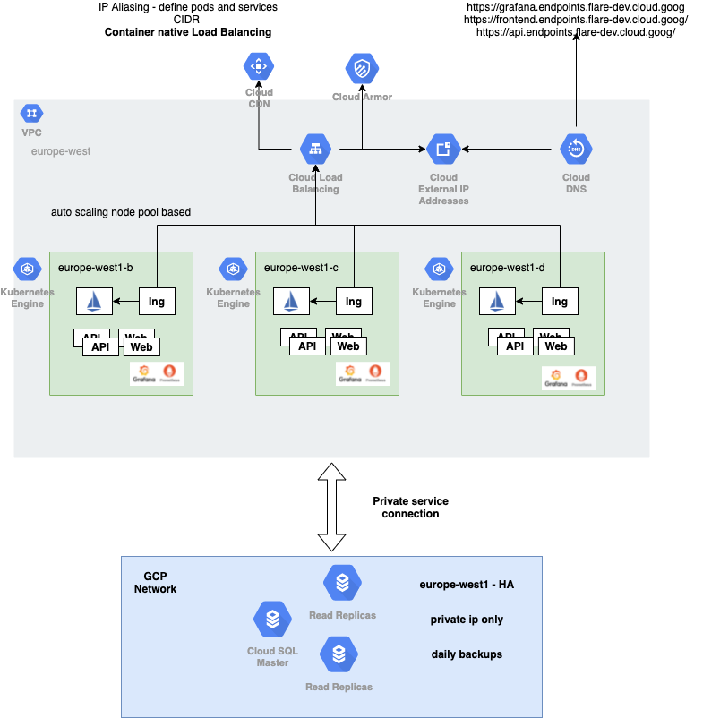

# GCP Prod example

This repo contains an example architecture to deploy a simple nodejs app in a kubernetes cluster.

The architecture leverages container native load balancing and the following image illustrates the different components.



# Ground

Contains terraform modules that provisions the following resources in GCP:

    * VPC
    * Subnetwork
    * GKE Cluster with ip aliasing to leverage container native loadbalancing and NEGs
    * A HA PostgresSQL cluster
    
## Running locally

 * You must have terraform and gcloud installed in your system.
 
 * A GCP Project to use and gcloud authenticated and configured properly. 
 
 * In the _local/_ folder you'll find examples. These use GCS as remote backend to store *tfstate*, replace *bucket*, *prefix* accordingly.
 
    
```
    cd _local/<resource>/
    terraform init
    terraform plan -input=false -out=tfplan
    terraform apply -input=false tfplan
    terraform output -json
```

# Gateway
    
    * install Istio in a kubernetes cluster using _istioctl_
    * install prometheus and grafana as recommended by the Istio team
    * expose the mesh using a kubernetes Ingress that will provision an HTTPS Global Loadbalancer in GCP

## Running locally

 * You must have terraform, istioctl, helm v3 and kubectl installed in your system.
 
 * A GCP Project to use and gcloud+kubectl authenticated and configured properly.

### TLDR;
    
    make upsert
    
    make delete

### Detailed
* First you should provision the necessary infrastructure to support the ingress. To do so, head over to the folder
_terraform/local/_ where you will find an example that uses the terraform module that will provision everything.

    ```
        cd terraform/local/
        terraform init
        terraform plan -input=false -out=tfplan
        terraform apply -input=false tfplan
        terraform output -json
    ```

* Next, install Istio using _istioctl_

    ```
        cd manifests/istio/
        istioctl install -f istio-operator.yaml --dry-run --skip-confirmation
        istioctl install -f istio-operator.yaml --skip-confirmation
    ``` 
 
* Next, install prometheus and grafana
 
    ```
         cd manifests/istio/
         kubectl apply --recursive -f /addons/
     ``` 

* Finally, let's create the ingress to expose the mesh
 
     ```
         cd chart/
         helm upgrade -i gateway gateway/
     ``` 
  
To delete check the Makefile.

## Terraform module

The terraform module support this repository will provision the following components:

    * a global static ip to use in the LB
    * A Cloud armor policy to use in the LB (Mitigate XSS attacks, ...)
    * DNS A records using GCP Endpoints

## Ingress chart

The ingress chart's goal is expose the mesh using a K8s Ingress. Additionally, we create the appropriate istio components
to expose grafana to the outside world.

The ingress will use a custom annotations and a BackendConfig to configure the GCP Global Loadbalancer.

    # enables or disables simple HTTP
    kubernetes.io/ingress.allow-http: "true"
    
    # the name of the global static ip to use
    kubernetes.io/ingress.global-static-ip-name: {{ .ip }}
    
    # certificates to use when accepting HTTPS
    networking.gke.io/managed-certificates: {{ join "," (keys .domains) }} 

The BackendConfig configures a specific health check to *istio-ingressgateway*, enables CDN and uses the given *securityPolicy*.
Check the *values.yaml* file to know more details. 

# Node app
Contains code for a Node.js multi-tier application.

The application overview is as follows

```
web <=> api <=> db
```

The folders `web` and `api` respectively describe how to install and run each app.

## Credits

This app was not created by Flare's team and is not production ready.

# istio-workload

A simple chart that deploys the following manifests to a kubernetes cluster:

    * Deployment
    * Service
    * DestinationRule
    * VirtualService
    
These components form the foundation needed to configure a kubernetes workload that gets traffic managed by Istio.

## Values

The following are the default values.

```yaml

environment: dev

replicaCount: 1

service:
  type: ClusterIP
  prefix: /toptal/v1/
  ports:
    - port: 80
      targetPort: 8080
      protocol: TCP
      name: tcp

deployment:
  maxUnavailable: 1
  maxSurge: 50%
  container:
    image:
      pullPolicy: IfNotPresent
      url:
    ports:
      - 8080
    environment:
    health:
      readiness:
        path: /health
        port: 8080
        initialDelaySeconds: 60
        timeoutSeconds: 2
        failureThreshold: 5
        periodSeconds: 5
      liveness:
        path: /health
        port: 8080
        initialDelaySeconds: 60
        timeoutSeconds: 2
        failureThreshold: 10
        periodSeconds: 5
    resources:
     requests:
       cpu: 100m
       memory: 100Mi
     limits:
       cpu: 300m
       memory: 300Mi

destinationRule:
  host: toptal-service.demo.svc.cluster.local
  tlsMode: DISABLE
  #https://istio:io/docs/reference/config/networking/destination-rule/#LoadBalancerSettings-SimpleLB
  lbMode: LEAST_CONN
  subsets:
    - name: v1
      labels:
        version: v1

virtualService:
  gateways:
    - istio-system/default-gateway
  hosts:
    - "*"
  match:
    - name: default
      prefixes:
        - /toptal/v1
      rewrite: /
      routes:
        - host: toptal-service.demo.svc.cluster.local
          port: 80

```

